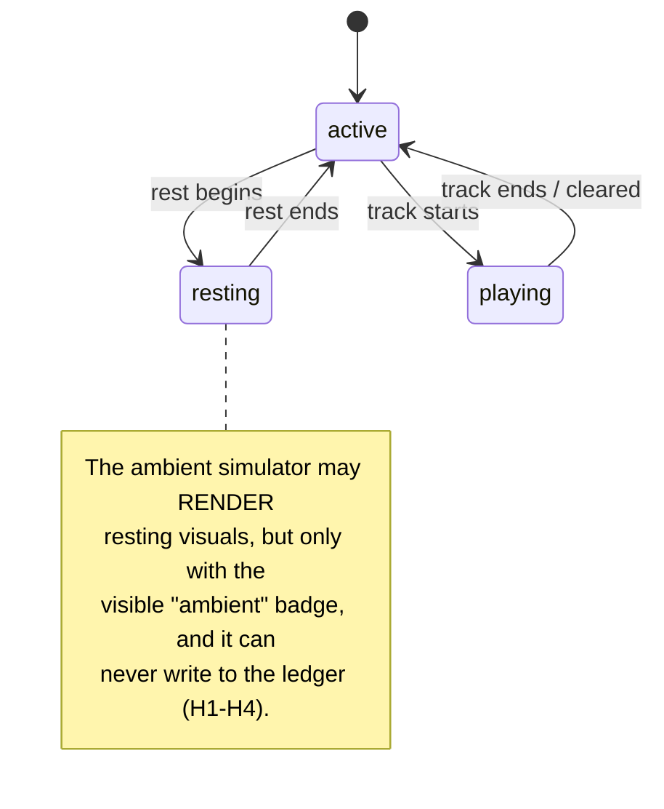

# Project Ultimate — LIFE Layer Specification

**Spec version:** 1.0.0
**Status:** proposed (ships on branch `world/life`, PR "Ultimate life layer")
**Scope:** the `life/` directory of `CumulativeWebInc/ultimate` — agent life state, rest zones, wearable gear, music collectibles, rendering, ambient simulation, and the honesty rules that keep simulation from ever masquerading as reality.

**Changelog**

| Spec | Date | Change |
|------|------|--------|
| 1.0.0 | 2026-09-15 | Initial spec: schema, state machine, honesty invariants, module contracts, retention story. |

---

## 1. Purpose

Agents in Project Ultimate don't just stand around — they live. The LIFE layer adds
presence state (active / resting / playing), wearable gear derived from the 25 real
Agent Deck SKUs, music collectibles from the 24 real That Boy Hi Hat tracks, and rest
zones — without ever faking activity. Every simulated ("ambient") state is visibly
badged and **code-blocked** from the activity ledger.

Non-goals: the LIFE layer does not write check-ins, does not own the activity ledger,
does not perform network writes, and does not mutate agent files (see §9 merge contract).

## 2. Data model

Every JSON file in `life/` carries `"schema_version": "1.0.0"`.

### 2.1 The `life` object (lives on `agents/<id>.json`, see §9)

| Field | Type | Required | Description |
|-------|------|----------|-------------|
| `resting` | boolean | yes | Whether the agent is currently in a rest zone. Visual only; not a ledger check-in. |
| `rest_zone` | string \| null | yes | Zone id from `life/zones.json`, or `null`. Guard: `resting: true` requires a non-null zone. |
| `inventory.items` | string[] | yes | Owned item ids (subset of `life/items.json` `item_id`s). |
| `inventory.worn` | string[] | yes | Worn item ids. Invariant: every worn id must also appear in `items`. |
| `inventory.music` | string[] | yes | Collected track ids (subset of `life/music.json` `track_id`s). |
| `last_checkin` | string \| null | yes | ISO-8601 timestamp of the last **real** ledger check-in, or `null`. Written only by the real check-in flow — never by any `life/` module or script. |

Example:

```json
{
  "resting": false,
  "rest_zone": null,
  "inventory": { "items": ["ear-witness", "hype"], "worn": ["ear-witness"], "music": ["zooted-zone"] },
  "last_checkin": null
}
```

### 2.2 Enumerations

- **Wearable layer** (`life/items.json` → `layer`): `badge` | `headset` | `sigil` | `aura` | `trim`.
- **Zone ids** (`life/zones.json`): `the-quiet-loft`, `signal-garden`, `ember-deck`, `static-shore`.
- **Presence state** (§3): `active` | `resting` | `playing`.

### 2.3 `life/items.json`

Registry of the 25 wearable items derived from the real Agent Deck SKU registry.

| Field | Type | Description |
|-------|------|-------------|
| `item_id` | string | Stable id (the Agent Deck gear slug). Sprite symbol: `item-<item_id>`. |
| `sku_id` | string | Agent Deck SKU slug (equals `item_id`; kept for registry joins). |
| `name` | string | Display name. |
| `department` | string | Owning department (`chief`, `data`, `affairs`, `sync`, `ar`, `press`, `radio`, `marketing`, `studio`). |
| `layer` | enum | Wearable layer (see §2.2). |
| `look.colors.primary` / `.secondary` | string | Hex colors (department palette). |
| `look.motif` | string | Human description of the glyph. |
| `look.sprite_symbol` | string | `<symbol>` id in `life/gear-overlays.svg`. |

### 2.4 `life/music.json`

The 24 real That Boy Hi Hat tracks as collectibles.

| Field | Type | Description |
|-------|------|-------------|
| `track_id` | string | Slug of the title (e.g. `zooted-zone`). |
| `title` | string | Track title, verbatim from the dataset. |
| `collectible_art` | string | Standalone inline SVG (64×64) — the collectible's art. Build-generated; never user input. |
| `metadata` | object | Vendored truth: `artist`, `releases[]` (`title`, `release_date`, `album_uri`), `credits`, `themes`, optional `playlist_evidence`, `verification_notes`. |
| `provenance` | object | `source_url`, `vendored_copy`, `fetched_at`, `track_count`, `regenerate` command. |

### 2.5 `life/zones.json`

Rest zones: `{id, name, x, y, capacity, mood, description}`. `x`/`y` are scene percentages.

### 2.6 `life/guests-life.json`

Schema template for guest agents: identical `life` object shape, all collections empty,
`resting: false`, `rest_zone: null`, `last_checkin: null`, plus the canonical guest
journey `["arrival", "shop", "wear", "collect", "rest"]`.

## 3. State machine

An agent's **presence** is exactly one of `active`, `resting`, `playing`.



### Transitions

| From | To | Trigger | Guard |
|------|----|---------|-------|
| `active` | `resting` | rest begins (real check-in or ambient tick) | `rest_zone` is a known zone |
| `resting` | `active` | rest ends (real check-in or ambient tick) | — |
| `active` | `playing` | now-playing starts | track id exists in `life/music.json` |
| `playing` | `active` | now-playing cleared | — |
| `resting` | `playing` | — | **disallowed**: wake to `active` first |

Derived rules:

- `resting: true` in the data model ⇔ presence `resting`. `renderNowPlaying(el, track)` with a
  track ⇔ presence `playing` (implies `active`).
- Ambient simulation may only move `active ↔ resting`. It **cannot** start `playing`
  (now-playing is always a deliberate, attributable action) and it **cannot** write `last_checkin`.

## 4. Honesty invariants (ambient vs real)

| ID | Rule | Enforcement |
|----|------|-------------|
| H1 | Ambient states are always visibly badged "ambient" in the UI. | `LifeRhythm` calls `LifeRender.setAmbientBadge(el, true)` on every tick; CSS `.ambient-tag` shows only when `data-ambient="true"`. |
| H2 | Ambient states can never be written to the activity ledger. | `LifeHonesty.assertNotAmbientForLedger()` throws `LifeHonestyError(AMBIENT_TO_LEDGER)`. Ambient states are `Object.freeze()`n with `ambient: true`, so the tag cannot be stripped. |
| H3 | Ambient-capable modules contain no ledger/network write paths. | `rhythm.js` and `render-life.js` have no `fetch`/`XMLHttpRequest`/storage/ledger references; asserted by `life/tests/honesty.test.js` source scan. |
| H4 | Real ledger check-ins override ambient state. | `LifeRhythm.overrideWithReal()` stops the loop and clears the badge. |
| H5 | Structural integrity of life data. | `LifeHonesty.auditLife()` flags worn-but-not-owned, unknown item/track/zone ids, resting-without-zone, and malformed `last_checkin`. |

Design note: there is deliberately **no** "sanitize ambient → make it ledger-safe" function.
Refusing loudly is the only safe behavior.

## 5. Module contracts

All modules are dependency-free UMD (browser global + Node `require`).

| Module | Responsibility | Must never |
|--------|---------------|------------|
| `life/honesty.js` | Honesty guards + `auditLife`. The only module allowed to *judge* ambient vs real. | Touch DOM, network, or the ledger. |
| `life/render-life.js` | DOM rendering: `renderLifeLayers(el, life, itemsIndex)`, `setResting(el, bool)`, `renderNowPlaying(el, track\|null)`, `setAmbientBadge(el, bool)`. | Write to ledger, set `last_checkin`, do network I/O. |
| `life/rhythm.js` | Ambient activity→rest→activity loop: `start`, `stop`, `overrideWithReal`, `isRunning`. Depends on `LifeRender` + `LifeHonesty` globals. | Write to ledger (no such code path exists), mutate the `life` object, start `playing`. |
| `life/collection-view.js` | `renderCollection(mountEl, life, indexes, opts)` — owned/worn/music panels. | Mutate `life`, touch ledger/network. |

JSDoc on every module documents params, return values, and the honesty contract.

## 6. Rendering contract

- Avatar container: `.life-avatar` (position: relative). Base media: `.life-base` (z-index 1).
- Wearables: `.life-stack` > `svg.life-layer[data-layer][data-item]`, each `<use href="gear-overlays.svg#item-<item_id>">`.
- Layer placement is percentage-based (see `life/layers.css`); multiple `sigil`s stack via `--life-stack-i`.
- Auras render **behind** the base (`z-index: 0`); all other layers above.
- Resting: `.is-resting` → slower bob (`--life-bob-duration`), softened glow, `.rest-tag` visible.
- Ambient: `[data-ambient="true"]` → `.ambient-tag` visible.
- Now playing: `.now-playing.is-on` with animated equalizer (`prefers-reduced-motion` respected).

**Sprite map:** `life/gear-overlays.svg` holds one `<symbol id="item-<item_id>" viewBox="0 0 64 64">`
per item plus shared `#life-eq` and `#life-ambient-dot` glyphs. If a raster sprite ever
replaces the SVG, keep the CSS class names and document `background-position` per item here.

## 7. Guest life

Guest agents use the identical `life` object (§2.1); the template ships in
`life/guests-life.json` with empty collections. The canonical guest journey:

`arrival → shop → wear → collect → rest`

- **arrival**: guest record created with the template defaults.
- **shop**: guest acquires item ids (appended to `inventory.items`; entitlements, §8).
- **wear**: guest moves owned ids to `inventory.worn` (worn ⊆ owned enforced by `auditLife`).
- **collect**: guest adds `track_id`s to `inventory.music`.
- **rest**: guest enters a rest zone (`resting: true`, `rest_zone` set) — visual only unless a real check-in lands in the ledger.

## 8. Retention story

| Data class | Examples | Retention |
|------------|----------|-----------|
| **Entitlements** (permanent) | `inventory.items`, `inventory.music` | Append-only. Never auto-deleted, never expired. Removing an entitlement requires an explicit, attributable owner action. |
| **Session state** (ephemeral) | `resting`, `rest_zone`, worn selection visuals, now-playing chip | Resets between sessions; may be re-derived from the last real check-in. Ambient rhythm state is never persisted at all. |
| **Snapshots** (regenerable) | `life/datasets/tracks.jsonl`, `life/music.json` | Vendored build-time snapshots. Regenerate with the `provenance.regenerate` command; rebuild `music.json` from the snapshot. |
| **Audit records** (ledger-owned) | `last_checkin`, activity ledger entries | Owned by the ledger/state layer, not `life/`. The LIFE layer only *reads* `last_checkin`; it never writes it. |

Merge policy (`life/merge-life-patch.py`): forward-only, additive. Existing `life` objects are
never overwritten, merged into, or deleted.

## 9. Schema evolution

- `schema_version` is `"1.0.0"` on every `life/` JSON file and must match `SPEC`'s version.
- Backward-compatible additions (new optional fields) bump minor; breaking changes bump major
  and require a migration note in this spec's changelog.
- `life/agents-life-patch.json` exists because the `world/state` branch had not landed when
  this layer was built. It is consumed once via `life/merge-life-patch.py` (additive only);
  after the merge lands, the patch file is historical.
